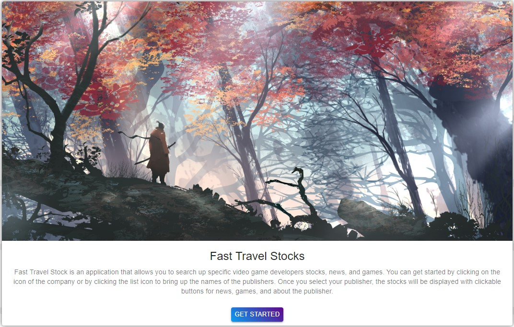
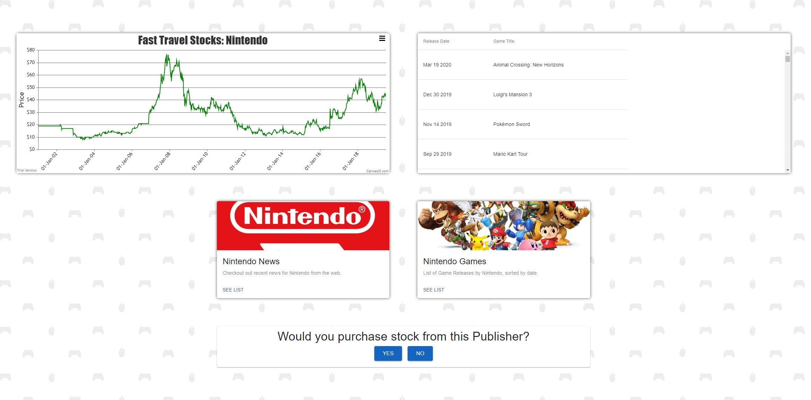
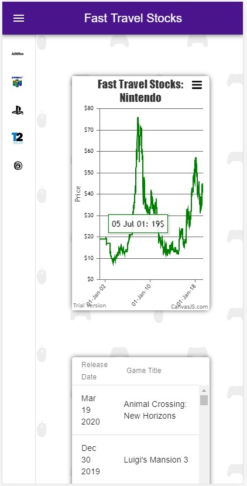
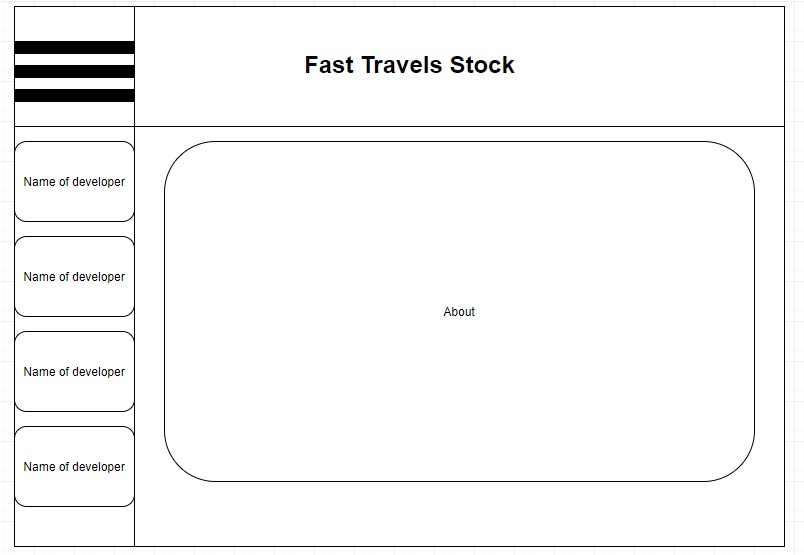
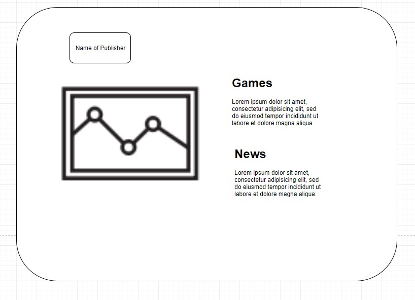
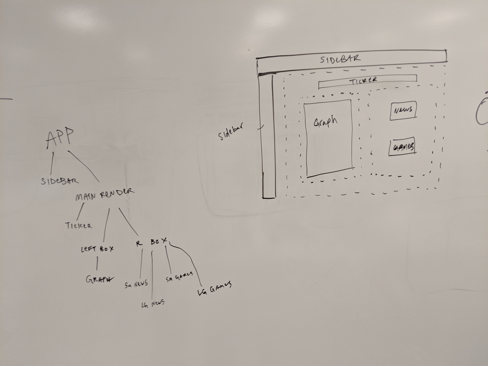

# Fast Travel Stocks
Fast Travel Stocks is an application allowing users to research specific video game publishers for stock, news, and game information. The application leverages APIs to gather information on a publisher's library of games, recent news, and stock price. Users can also vote on whether they would invest in a certain publisher or not.

## Value Add Proposal
Have you ever wondered why a video game publisher found success? Or why they lost it? We were also curious. Fast Travel Stocks takes a look at the historical stock prices for different publishers and compares that to their game releases and relevant news stories to see how their releases and headlines affected their stock price.

## Team Members

- Alex Abbott - Fullstack Engineer
- Emmanuel Zapata - Fullstack Engineer
- Caleb Rose - Fullstack Engineer
- Jake Stevens - Fullstack Engineer

## Team Management
[Project Board](https://github.com/the-warp-zone/FastTravelStocks/projects/1)

# Demo
Our application is hosted [here](https://fast-travel-stocks-warp.herokuapp.com/).

## Release 1.0 MVP
User interface:




## Tech Stack
Fast Travel Stocks uses a Node.js backend alongside Sequelize.js for our SQL DB and Express.js for routing in order to utilize a JawsDB. The frontend is built using the React.js library, with styling done using the Material-UI react library. The frontend takes advantage of a number of APIs in order to display the proper data for the selected publisher.

## UI Design


Early on we chose as a group to implement Material-UI for our project because of their large amount of React documentation and very pleasing style. Material did throw us a big curve ball because we initially designed our individual components as class based components. The problem with this was that all of Material-UI's documentation uses functional components. We had already written integral components as classes, but couldnt implement Material-UI's styles from their core package without setting up our components as functional. Blocker. This is where we had to take a step back and learn React Hooks. After some research had been done and with the help of our wonderful teachers we transitioned some of our components to functions and got everything looking great.
```javascript
const useStyles = makeStyles({
  card: {
    marginBottom: "30%",
    width: "100%",
    boxShadow: "0px 0px 8px 0px rgba(0,0,0,0.65)"
  },
  media: {
    height: 500
  }
});

const LandingPage = props => {
  const classes = useStyles();
  const bStyle = {
    margin: "auto",
    background: "linear-gradient(45deg, #0a9df1 , #62058d )",
    color: "white"
  };
  
  ... 
  
  <Card className={classes.card}>
      <CardMedia
        className={classes.media}
        image={LandingPic}
        title="Fast Travel Stocks"
      />
  
```

## Component Trees: When Conditional Rendering Strikes Back
Okay, conditional rendering. Sounds simple enough. We know how to write conditional statements. That couldnt be too hard, right?

### Wrong.
Turns out it takes much more thought than adding in a few if statements. It was at this point, we knew, we had messed up. After we had designed our components on their own, it was time to call them all in our App.js file and get event listeners set up to make everything work together. This is where react hooks came into play for us. We had data being called in files higher up, we needed to pass that information down the tree and render components based on if that information had been recieved yet. Thats when we created our hooks to be able to pass down our render conditions and set up event listeners.
```javascript
function AppLoader() {
  const classes = useStyles();
  const [isLandingClicked, setLanding] = React.useState(false);
  const [isButtonClicked, setClicked] = React.useState(false);
  const [publisherData, setPublisher] = React.useState("");
  const [whichList, setList] = React.useState(true);
  const [totalYesCount, setYesTotal] = React.useState(0);
  const [totalNoCount, setNoTotal] = React.useState(0);

  function getStarted() {
    setLanding(true);
    setPublisher("Nintendo");
    voteOptions("Nintendo");
  }

  function getPublisherInfo(event) {
    if (!isLandingClicked){
      getStarted(); // isLandingClicked is false, call the getStarted function
    }
      var publisher = event.currentTarget.getAttribute("value");
      setPublisher(publisher);
      if(isButtonClicked) setClicked(false);
  }
```
## Stocks Graph
The stocks graph was designed using the CanvasJS library and Alphavantage API. When selecting a publisher, a request is pulled from Alphavantage to graph the closing stock price from each week from the publisher's IPO reveal to the current day. Users can traverse on the graph to see what the price of the stock was on a given week. The user can also click and drag anywhere on the graph in order to zoom in, for a more in-depth look within a given period of time. The user is able to reset the graph using a refresh button that appears in the top-righthand corner of the graph. As well the user can drag the graph to move it on its x or y axis.

### Making the Chart
Right out of the gate when discussing the idea of the overall app, the stock price was going to be the cornerstone. We had initially thought of using the D3 library. Diving further into some research for this, it was clear how involved of a process it is to build a D3 chart. D3 has some awesome visualizations for all kinds of data, even very obscure datasets that require very unique charts to display. D3 also has a very steep learning curve to it. We knew right away that we weren't going to want to invest that much time into learning the chart library for a line chart, so we looked to other libraries like Chart.js and CanvasJS. CanvasJS specifically had verbose documentation code for react and had zoom functionality built in, which would be critical for showing in some cases 20+ years of financial data on a single graph. Their charts are very straight forward and have great customization options that are easy to implement.

## Games Card
The Games card grabs the publisher's library using the IGDB API. Information provided includes the release date, and title. Users can use this information to pinpoint on the graph adjustments to stock price changes after certain release dates.

### Making the Games List
IGDB(Internet Game Database)has an ocean of information for all things video games. We made an API call with a specific publisher in mind and got a list of all the games they had ever released. We drilled down into the object that was returned and pulled out just the date of each game release, and the title of the game. We then made a new array pairing the values together. We had to talk our unix time code into switching over with Moment.js. We then ordered the list based on their calendar date and used a Material-UI list component to give it a scrollable view, because these lists are LARGE. As well there are games on this list from our API which did not have a release date yet, because they were only just announced. We had to filter those out because it was destroying our ordering, trying to order the date of a game that returned undefined in the response object.
```javascript
.then(response => {
        let obj = response.data[0]["published"];
        let firstList = [];
        for (var property in obj) {
          let x = obj[property]["name"];
          let y = obj[property]["first_release_date"];
          firstList.push([moment.unix(y).format("MMM DD YYYY"), x]);
        }

        const result = firstList.filter(title => title[0] !== "Invalid date");
        const result2 = result.filter(title => title[1] !== undefined);
        let gamesList = result2.sort(
          (a, b) =>
            new moment(b[0], "MMM DD YYYY") - new moment(a[0], "MMM DD YYYY")
        );
        this.setState({ gamesList });
```
## News Card
The News card grabs the ten most recent articles and displays them as individual items within the card. Each list item contains a short description of the article, and allows the user to click the title of each article which is a link to allow them to view the article itself.

### Making the News List
Unfortunely this part our app was much grander during conception. We wanted to compare articles to the entirety of our stock price data, some of which goes back more than two decades. This was part of the idea before we coded a single line. After digging around documentation for news API's we found that there was a 0 chance we could get that kind of information for free. Most news API's offer articles going back a few months at most for free. We still loved the idea of seeing news for each publisher, and decided we could still compare their news to their recent stock price data. With that in mind, we got our API call to return articles: their titles, descriptions, and thumbnails. We found some kind of contact card on Material-UI and wrote a .map() to make a card for each article with all of its contents. We hit a blocker trying to put the news in a scrolling component similar to an iFrame, took the time to figure it out using an npm package called "react-infinite-scroll-component" and later realized it was unnecessary because porting it into a Material-UI component took care of that.
```javascript
  getFinalList(titles, descriptions) {
    let a = [];
    for (let i = 0; i < titles.length; i++) {
      a.push([titles[i], descriptions[i]]);
    }
    return a;
  }
  getTitles(articles) {
    let a = [];
    for (let i = 0; i < articles.length; i++) {
      a.push(articles[i].title.replace(/<b>/g, "").replace(/<\/b>/g, ""));
    }
    return a;
  }
  getDescriptions(articles) {
    let a = [];
    for (let i = 0; i < articles.length; i++) {
      a.push(articles[i].description.replace(/<b>/g, "").replace(/<\/b>/g, ""));
    }
    return a;
    
    ...
    
  const newsItem = props.data.map(item => (
    <NewsListItem key={id++} data={item} />
  ));
  ```
  
## Stock Poll
The user is prompted on whether they would invest in a selected publisher, or not. After making a choice, the user is presented with statistical information on who else said yes or no on investing in a certain stock.

### Making the Stock Poll
This portion of our app was a really big learning experience for us as a team. Sequelize and Express were not considered common knowledge for us as a team. The act of setting up our express routes and making the correct axios calls to our DB was the bane of our existence. After much help from our teachers we got communication between front end and DB. We set up the voting system with sequelize to trigger a post(.create) to add in a new row in the DB and then instantly trigger a get(.findAll) so we could display poll results to the user after they had voted.
```javascript
  var setCounts = (arr) => {
    let totalYes = 0;
    let totalNo = 0;
    for(let i = 0; i < arr.length; i++){
      if(arr[i].yes_count === 1) totalYes++;
      else if(arr[i].no_count === 1) totalNo++;
    }
    setYesTotal(totalYes);
    setNoTotal(totalNo);
  }

  var setVote = (event) => {
    setClicked(true);
    var newCountYes = 0;
    var newCountNo = 0;
    var buttonVal = event.currentTarget.getAttribute("value");
    if(buttonVal === "Yes") {
      newCountYes =  newCountYes + 1;
    } else if (buttonVal === "No") {
      newCountNo = newCountNo + 1;
    }
    putVote(publisherData, newCountYes, newCountNo);
    // getPollResults();
  }

  var putVote = (param, countYes, countNo) => {
    axios({
      url:
        "/api/survey/create/" + param,
      method: "POST",
      headers: {
        Accept: "application/json"
      },
      data: {
        yes_count: countYes,
        no_count: countNo 
      }
    })
```
# Release 2.0
A few things we want to see in the next version:
* Add in more publishers(not all publishers are publicly traded)
* Attach a link the each game title in the Games List so the user could click on a game and be directed to another site for more information on that title.
* Implement a search function to the games list so you could see games only for a specific date range.
* Authentication to make sure that each unique user could only vote in the publisher poll once for each publisher.
* We messed with the idea of porting this app into an electron app, but did not have time to learn electron.
* Having a toggable candlestick chart with more stock information
